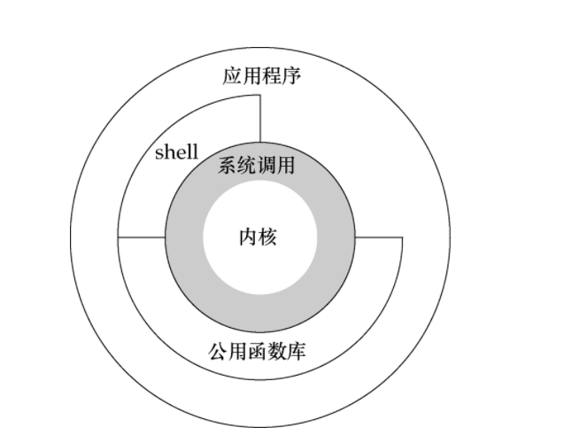
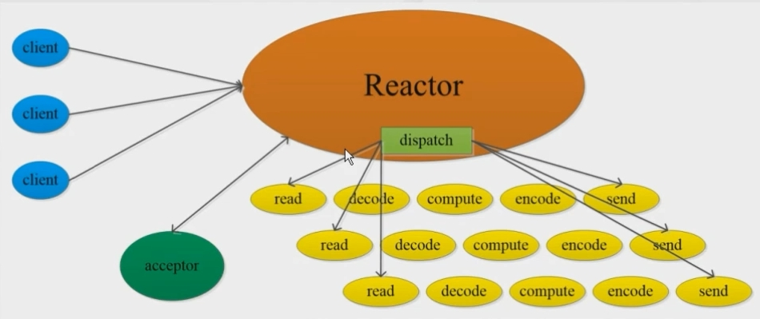
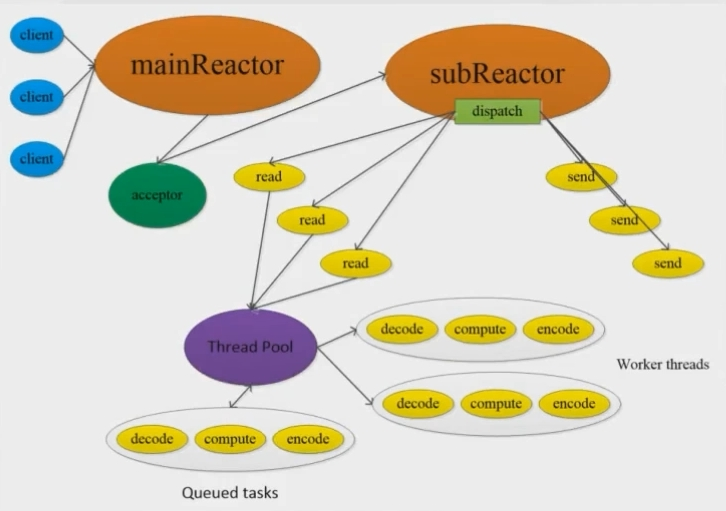
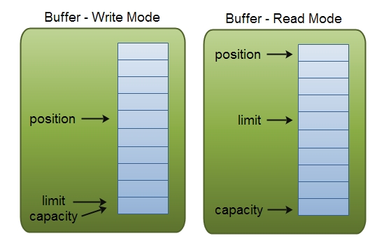

[TOC]
学习网站 https://ifeve.com/buffers/#writetobuffer

### 一、NIO概述
#### 1.关于Linux的内核态和用户态

```
内核的作用：管理内存、管理文件系统、管理cpu

应用程序 系统调用才能调用到 内核态中的资源

应用程序IO有两个阶段：
    1.发出请求给OS
    2.OS处理数据，从硬盘读取数据到缓冲区，再发送到缓存区
    在2中，应用程序没发做其他时间代表阻塞
```



#### 2.核心组件
```
channel
buffer:
    NIO是面向buffer,BIO面向流
    就是一个数组，理解成内存的数据
selector：
    轮询事件
unsafe
```

#### 3.什么是同步IO、异步IO、阻塞IO、非阻塞IO

#### 4.非阻塞IO模型（NIO模型）
##### 1.Reactor线程模型
- 多路复用选择器(selector) 
- 包含Java NIO的selector反应堆
- Reactor线程模型组成
```
接收请求连接的acceptor 和 处理客户端IO线程两部分组成

“acceptor线程”和“IO处理线程”可以是同一个线程,也可以是不同线程,或者对应的线程池
```

##### 2.NIO+单线程Reactor模型
- 一个线程绑定Selector,由这个线程来处理Selector的所有IO事件(客户端建立连接、已经建立连接客户端socket的IO事件请求)
- 本Reactor模型中的新客户端连接建立的acceptor线程和已经建立连接socket的IO请求处理线程是同一个线程
- 缺点
```
连接和IO请求都是一个线程处理,当前线程正在处理某个客户端的数据读写IO请求，则无法处理当前的新建连接的客户端的请求，会导致客户端无法建立连接或者超时

虽然单线程没有线程的上下文切换，但是处理能力是有限的
```



##### 3.NIO+多线程Reactor模型
- 与单线程的区别
```
已经建立连接的客户端套接字的IO事件是在另外一个线程或者另外一个线程池来处理的，这种线程也称为IO线程，而处理监听套接字的新客户端连接请求的线程则还是一个独立的Acceptor线程
```

- 处理流程
```
使用独立Acceptor线程监听socket进而监听连接请求；
当监听到新的客户端时，创建该客户端对应的channel并注册到其他一个IO线程Selector,该Selector监视和获取该客户端channel后续的读写IO事件并进行处理。

```


### 二、NIO Channel
#### 1.概述
```
channel有点像流，可以数据可以从channel到Buffer，也可以从Buffer到channel

channel的实现：
    FileChannel
    DatagramChannel
    SocketChannel
    ServerSocketChannel
```

### 三、NIO Buffer
#### 1.概述
```
buffer的实现：
    ByteBuffer
    CharBuffer
    DoubleBuffer
    FloatBuffer
    IntBuffer
    LongBuffer
    ShortBuffer
```


#### 2.基本用法
```
Buffer就可以看做成一个数组

Buffer有四个指标:
(1) mark 可以做标记，初始值为-1
(2) position 记录游标写到哪里了
(3) limit 限制,超出了这个值就需要扩容
(4) capacity 数组最大容量

Buffer四个操作以及指标的变化
(1) 初始化 mark=-1,,position=0,limit=capacity=buffer.length()
(2) put() position++,其他的不变
(3) flit() limit=position,positon=0
(4) rewind() position=0  可以读到非写区域，可以实现重复读


使用Buffer读写数据有三步：
(1) 调用put(),写入到Buffer
(2) 调用flip()方法,从Buffer读取数据
(3) 调用clear()或compact()方法


当向buffer写入数据时，buffer会记录下写了多少数据。
一旦要读取数据，需要通过flip()方法将Buffer从写模式切换到读模式。在读模式下，可以读取之前写入到buffer的所有数据。

一旦读完了所有的数据，就需要清空缓冲区，让它可以再次被写入。
有两种方式能清空缓冲区：调用clear()或compact()方法。clear()方法会清空整个缓冲区。compact()方法只会清除已经读过的数据。任何未读的数据都被移到缓冲区的起始处，新写入的数据将放到缓冲区未读数据的后面。
```


#### 2.代码demo
```
RandomAccessFile aFile = new RandomAccessFile("data/nio-data.txt", "rw");
FileChannel inChannel = aFile.getChannel();
//create buffer with capacity of 48 bytes
ByteBuffer buf = ByteBuffer.allocate(48);
int bytesRead = inChannel.read(buf); //read into buffer.
while (bytesRead != -1) {
  buf.flip();  //make buffer ready for read
  while(buf.hasRemaining()){
      System.out.print((char) buf.get()); // read 1 byte at a time
  }
  buf.clear(); //make buffer ready for writing
  bytesRead = inChannel.read(buf);
}
aFile.close();

```


