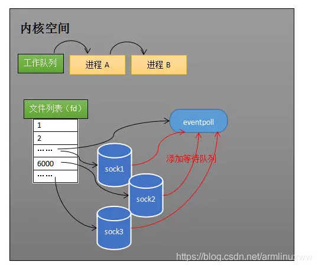

任何socket的数据都准备好了，selector都知道


如何知道？

有三种通知模式：select、poll、epoll，其实就是Linux内核的三个函数

> 1.select模式

遍历、
数组、
每次调用都进行线性遍历，时间复杂度是O(n)、
最大连接有上限

> 2.poll模式

遍历、
链表、
每次调用都进行线性遍历，时间复杂度是O(n)、
最大连接无上限

> 3.epoll模式

回调、
哈希表、
事件通知方式(硬件？)，每当有IO事件就绪，系统注册的回调函数就会被调用，时间复杂度O(1)、
最大连接数无上限


```
selector实际就是两个集合、管理各种事件、底层是epoll
selector有两个集合，一个是channel集合，注册channel到这个集合；一个是事件集合，通过中断加入集合
```

#### jdk IO多路复用的变化
```
NIO jdk1.4 是用select实现的，不是基于事件驱动；
 
NIO jdk1.5后，epoll实现的，基于事件响应
```

#### epoll
```
epoll
https://www.jianshu.com/p/085992ab58e5
https://blog.csdn.net/armlinuxww/article/details/92803381
epoll是Linux内核为处理大批量fd而作了改进的poll
原因就是获取事件的时候，它无须遍历整个被侦听的描述符集，只要遍历那些被内核IO事件异步唤醒而加入Ready队列的描述符集合就行
中断：CPU 理应中断掉正在执行的程序，去做出响应;当 CPU 完成对硬件的响应后，再重新执行用户程序

网卡会把接收到的数据写入内存==>
    如何知道接收了数据? 当网卡把数据写入到内存后，网卡向 CPU 发出一个中断信号，操作系统便能得知有新数据到来，再通过网卡中断程序去处理数据。
进程阻塞为什么不占用 CPU 资源?

文件描述符(file descriptor):
    kernel利用fd来访问文件
    fd是非负整数,打开现存文件或者新建文件时kernel都会返回一个fd
    os为每一个线程维护了一个fd表,该表的值从0开始的
```


```
操作系统如何知道网络数据对应于哪个 Socket?
    内核可以通过端口号找到对应的 Socket
    为了提高处理速度，操作系统会维护端口号到 Socket 的索引结构，以快速读取

```
#### 如何同时监视多个 Socket 的数据?（多路复用）

```
解决1：select

     Select 的设计思想：预先传入一个 Socket 列表，如果列表中的 Socket 都没有数据，挂起进程，直到有一个 Socket 收到数据，唤醒进程
     缺点：每次调用 Select 都需要将进程加入到所有监视 Socket 的等待队列，每次唤醒都需要从每个队列中移除。这里涉及了两次遍历，而且每次都要将整个 FDS 列表传递给内核，有一定的开销。
        两次遍历：1.遍历进程等待队列,唤醒进程。2.遍历文件列表,确定是哪个socket接收到数据
        
        
解决2: Poll

    Poll 和 Select 基本一样，有少量改进
```


```
解决3:

>>>>
Epoll 技术要解决的问题
    有没有减少遍历的方法?
    有没有保存就绪 Socket 的方法?

>>>> 1.epoll_ctl 和 epoll_wait   
Select 低效的原因之一是将“维护等待队列”和“阻塞进程”两个步骤合二为一
Epoll 将这两个操作分开，先用 epoll_ctl 维护等待队列，再调用 epoll_wait 阻塞进程。


先用 epoll_create 创建一个 Epoll 对象 Epfd，再通过 epoll_ctl 将需要监视的 Socket 添加到 Epfd 中，最后调用 epoll_wait 等待数据
    
    int s = socket(AF_INET, SOCK_STREAM, 0);    
    bind(s, ...) 
    listen(s, ...) 
     
    int epfd = epoll_create(...); 
    epoll_ctl(epfd, ...); //将所有需要监听的socket添加到epfd中 
     
    while(1){ 
        int n = epoll_wait(...) 
        for(接收到数据的socket){ 
            //处理 
        } 
    }
    
    
    
    
>>>> 2.就绪列表装就绪的socket引用
Select 低效的另一个原因在于程序不知道哪些 Socket 收到数据，只能一个个遍历。如果内核维护一个“就绪列表”，引用收到数据的 Socket，就能避免遍历。


```


#### [Epoll 的原理与工作流程](https://blog.csdn.net/armlinuxww/article/details/92803381)

```
1.创建Epoll对象
    某个进程调用epoll_create方法,内核会创建一个eventPoll对象
    eventpoll 对象也是文件系统中的一员，和 Socket 一样，它也会有等待队列
    内核要维护“就绪列表”等数据是eventpoll~的成员
    
2.维护监视列表
    通过epoll_ctl添加和删除需要监听的Socket
    socket收到数据后，中断程序会操作eventpoll对象，而不是直接操作进程
    
3.接收数据
    socket接收到数据后，中断程序会给eventpoll的"就绪列表"添加该socket的引用
    socket的数据接收并不影响进程，而是通过改变eventepoll的就绪列表来改变进程的状态
    
4.阻塞和唤醒进程
    当程序执行到 epoll_wait 时，如果 Rdlist 已经引用了 Socket，那么 epoll_wait 直接返回，如果 Rdlist 为空，阻塞进程, 放入 eventpoll 的等待队列中。
    当socket接收到数据，中断程序一方面修改eventpoll的Rdlist,一方面唤醒eventpoll的等待队列中的线程,因为Rdlist的存在,线程也知道哪个socket发生变化

```




