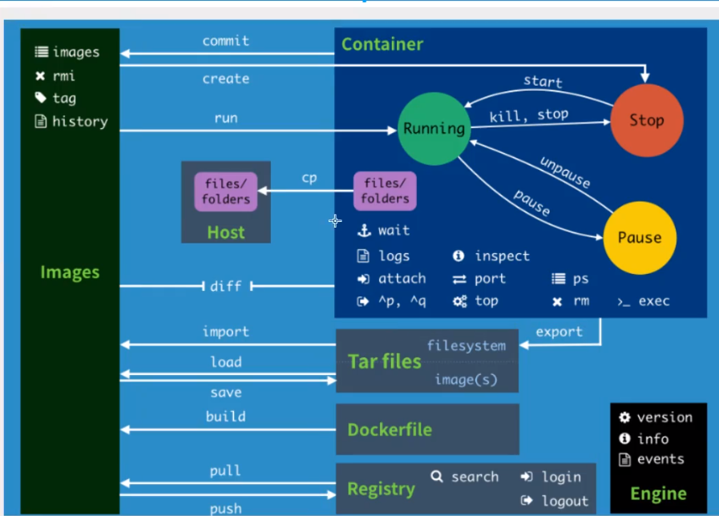
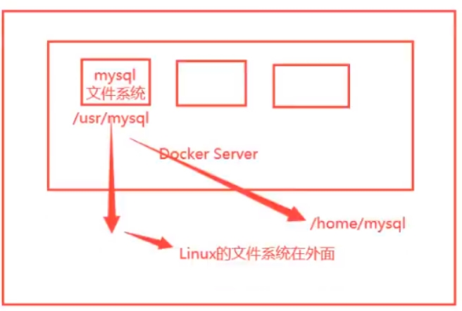
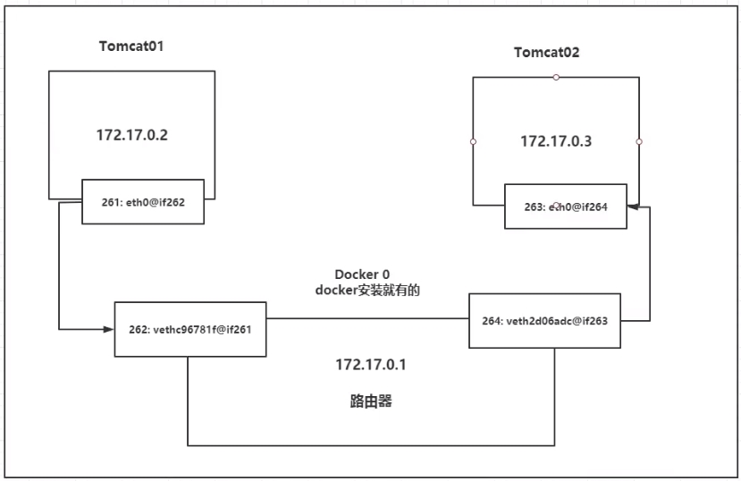
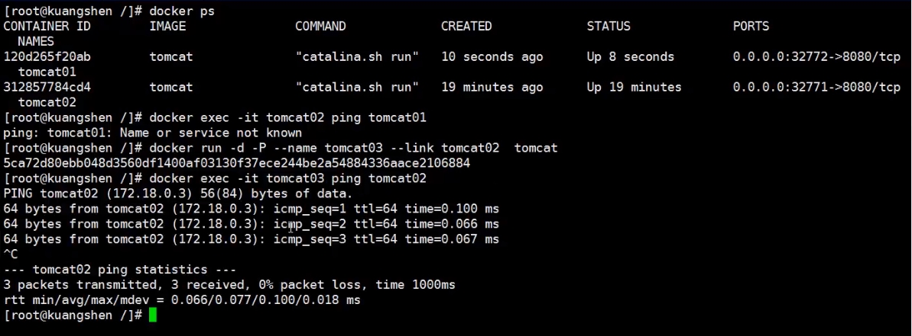

# Docker 基础


### 一、Docker 概述

#### 1.简介

项目带上环境安装打包 ， 发布一个项目 (jar + 环境)

#### 2.Docker的历史

2010年,几个搞IT的年轻人,美国成立一家公司dotCloud。
做一些pass的云计算服务,LXC有关的容器技术
他们将自己的技术(容器化技术)命名就是Docker

Docker刚刚诞生的时候,还没引起行业的注意！dotCloud活不下去

开放源代码！

2013年,Docker开源!
Docker越来越多人发现docker优点！
2014年4月9月,Docker1.0发布！


为什么这么火？ 十分轻巧

虚拟机笨重。虚拟机是虚拟化技术、Docker容器技术,也是虚拟化技术

注意：
LXC：Linux Container容器是一种内核虚拟化技术，可以提供轻量级的虚拟化，以便隔离进程和资源。 

#### 3.聊聊Docker

是用Go语言开发的,开源项目

文档地址：https://docs.docker.com/ Docker的文档是超级详细的

仓库地址: https://hub.docker.com/

#### 4.Docker能干嘛

之前的虚拟机技术：
- 缺点
    资源占用十分多、冗余步骤多、启动很慢

容器化技术：
- 容器化技术不是模拟的完整的操作系统
    
容器化技术和虚拟机技术不同
- 传统虚拟机技术,虚拟一条硬件，运行一个完整的操作系统
- 容器内的应用直接运行在宿主机的内核，容器是没有自己的内核的,也没有虚拟硬件,所以轻便
- 每个容器间都是互相隔离的,每个容器内都有自己的文件系统,互不影响


#### 5.DevOps（开发、运维）


更快速的交付和部署

- 传统：一堆文档、安装程序

- Docker：打包镜像发布测试、一键运行

更便捷的升级和扩缩容

更简单的系统运维
- 在容器化之后，我们的开发,测试环境都是高度一致的

更高效的计算资源利用

- Docker是内核级别的虚拟化，可以在物理机上可以运行很多容器实例！服务器的性能可以被压榨的极致


### 二、Docker 安装


#### 1.Docker组成
- image(镜像)

镜像就好比是一个模板,通过模板可以创建容器(docker run)

通过镜像可以创建多个容器

- container(容器)

可以把容器简单理解为一个缩小版的Linux

- repository(仓库)

存放镜像的地方，仓库分为共有仓库额私有仓库，可以类比maven仓库

Docker Hub、阿里云... 等都有自己的容器服务器

#### 2.安装Docker
- 环境要求

Linux：CentOS7、内核是3.10以上

查看命令:
```
系统版本：cat /ect/os-release
内核版本：uname -r   
```
- 安装步骤
```
1.卸载旧版本

sudo yum remove docker \
                  docker-client \
                  docker-client-latest \
                  docker-common \
                  docker-latest \
                  docker-latest-logrotate \
                  docker-logrotate \
                  docker-engine
                  

2.需要的安装包

sudo yum install -y yum-utils

3.设置镜像仓库(默认国外的,设置成阿里云的)

sudo yum-config-manager \
    --add-repo \
    http://mirrors.aliyun.com/docker-ce/linux/centos/docker-ce.repo
    
//更新yum软件包索引
yum makecache fast

4.安装docker 

sudo yum install docker-ce docker-ce-cli containerd.io

5.启动docker

sudo systemctl start docker


6.查看版本,看是否启动成功

docker version


运行Hello-Wold
sudo docker run hello-world
  
```

- 卸载docker
```
1.卸载依赖
yum remove docker-ce docker-ce-cli containerd.io
2.删除资源
rm -rf /var/lib/docker
```

#### 3.docker run 的流程

```
Docker 会在本地寻找image
    如果本机找到 --> 使用这个image运行
    如果没有,去Docker hub上下载 -->
        下载成功 --> 使用下载的这个image运行
        没有下载资源 --> 报错 
```

### 三、Docker 命令

#### 1.帮助命令

```
docker version
docker info
docker 命令 --help
帮助文档地址：https://docs.docker.com/reference/
```
#### 2.镜像命令

```
docker images  -aq //查看本地机器上所有的镜像
docker search
docker pull 镜像名[:version] //pull是分层下载的,若没有指定版本默认使用最新的版本
docker rmi -f [imageid,...]|$(docker images -aq)
```

#### 3.容器命令

```
说明：我们有了镜像才会有容器

//运行容器
docker run image 
    --name="" 容器名字,用来区分多个容器
    -d        后台方式运行
    -it       使用交互方式运行,进如到容器查看内容
    -p        指定容器端口号 -p:8080:8080
    
//列出运行的容器
docker ps -a
docker ps -a -n=1
docker ps -aq

//退出容器
exit 直接停止容器并且退出
ctril+p+q  容器不停止的退出

//删除容器
docker rm 容器id
docker rm -f $(docker ps -aq)

//停止和启动容器
docker start 容器id
docker stop 容器id
docker restart 容器id
docker kill 容器id


eg:
>>>1
docker run -it centos /bin/bash
exit
```

#### 4.其他命令
- 查看docker状态(占用内存等信息)
```
docker stats
```

- 后台启动容器
```
docker run -d 镜像名
docker run -dit 镜像名
https://blog.csdn.net/weixin_34356310/article/details/92178989
```
- 查看日志
```
docker logs -tf --tail 容器names

eg:
docker run -d centos /bin/sh -c "while true;do echo yejiang;sleep 1;done;"
```

- 查看元数据

```
docker inspect 容器id 
```

- 进入当前正在运行的容器
```
方式一：exec --> 进入容器后开启一个新的终端,可以在里面操作(常用)

docker exec -it 容器id bashShell

方式二：attach -->进入容器正在执行的中断,不会启动新的进程

docker attach 容器id
```

- 从容器中拷贝文件到主机上
```
docker cp 容器id:容器内的路径 目的主机路径
```

#### 5.命令图



### Docker 镜像
#### 1.镜像是什么？
```
所有应用，直接打包包括库、运行时环境、配置文件等，打包成docker镜像，就可以直接跑起来
```
#### 2.镜像加载原理
- UnionFS(联合文件系统)
- 镜像加载原理
#### 3.分层的理解

现象：下载的时候可以看出是一层层的在下载

好处和特点?
```

特点：
Docker镜像都是只读的，当容器启动时，一个新的可写层被加载到镜像顶部
这一层通常是我们说的容器层，容器之下都叫镜像层
```

可以通过docker image inspect查看分层
```
"RootFS":{}
```

#### 4.提交自己的commit
```
commit镜像
docker commit 提交容器成为一个新的副本

命令和git原理类似
docker commit -m="提交的描述信息" -a="作者" 目标镜像名字:[TAG]

docker commit -m="add webapp tomcat" -a="muyer" 3a1c9e8dc146 tomcat01:1.0

```

### Docker 容器数据卷

#### 1.什么是数据卷

数据都在容器中，如果删除了容器，数据都将丢失，所以就出现了数据卷的概念。

简单来讲就是容器的数据同步技术，Docker容器的数据可以同步到本地




#### 2.使用数据券
```
docker run -v 主机目录:容器目录

docker run -it --name tomcat01 -v /test:/webapps/ tomcat:9.0

"Mounts": [
            {
                "Type": "bind",
                "Source": "/test",
                "Destination": "/webapps",
                "Mode": "",
                "RW": true,
                "Propagation": "rprivate"
            }
        ]
```

#### 3.实战安装mysql,使用数据卷
#### 4.如何确定是具名、匿名、指定路径挂载？
- 具名挂载
```
docker run -it --name tomcat02 -v tomcat02:/webapps tomcat:9.0

"Mounts": [
            {
                "Type": "volume",
                "Name": "tomcat02",
                "Source": "/var/lib/docker/volumes/tomcat02/_data",
                "Destination": "/webapps",
                "Driver": "local",
                "Mode": "z",
                "RW": true,
                "Propagation": ""
            }
        ]
        
查看所有volume情况(docker volume ls)   
DRIVER    VOLUME NAME
local     tomcat02


```
- 匿名挂载
```
-v 容器内路径
docker run -it --name tomcat03 -v /webapps tomcat:9.0

"Mounts": [
            {
                "Type": "volume",
                "Name": "9b4a7bcc28c1d7ff6cfd5438e97750ef1e6ecf20b1b4baade0767925e11c5850",
                "Source": "/var/lib/docker/volumes/9b4a7bcc28c1d7ff6cfd5438e97750ef1e6ecf20b1b4baade0767925e11c5850/_data",
                "Destination": "/webapps",
                "Driver": "local",
                "Mode": "",
                "RW": true,
                "Propagation": ""
            }
        ]


查看所有volume情况(docker volume ls)
DRIVER    VOLUME NAME
local     9b4a7bcc28c1d7ff6cfd5438e97750ef1e6ecf20b1b4baade0767925e11c5850
 
```

- 指定路径挂载
```
docker run -it --name tomcat01 -v /test:/webapps/ tomcat:9.0
```

- 总结
```

(1)判定？
- v 容器内路径 ==> 匿名挂载
- v 卷名:容器内路径 ==> 具名挂载
- v /宿主路径:容器内路径 ==> 指定路径挂载

(2)所有docker的数据券没有指定路径,都会默认在主机的地址
/var/lib/docker/volumes/xxxx/_data

(3)-v 容器内路径:ro rw 改变读写权限
ro readnoly; rw readwrite
docker run -it --name tomcat02 -v tomcat02:/webapps:ro tomcat:9.0
docker run -it --name tomcat02 -v tomcat02:/webapps:rw tomcat:9.0
一旦加了权限,容器就会对挂载出来的数据有限制了
```
### DockerFile
DockerFile就是用来构建docker都镜像构建文件！命令脚本！
#### 1.DockerFile 介绍
#### 2.DockerFile 构建过程
#### 3.DockerFile 指令
#### 4.实战构建自己的centos、tomcat


### Docker 网络原理
#### 1.理解Docker0 
```
# ip addr
1: lo: <LOOPBACK,UP,LOWER_UP> mtu 65536 qdisc noqueue state UNKNOWN group default qlen 1000
    link/loopback 00:00:00:00:00:00 brd 00:00:00:00:00:00
    inet 127.0.0.1/8 scope host lo
       valid_lft forever preferred_lft forever
2: eth0: <BROADCAST,MULTICAST,UP,LOWER_UP> mtu 1500 qdisc pfifo_fast state UP group default qlen 1000
    link/ether 00:16:3e:0b:9e:91 brd ff:ff:ff:ff:ff:ff
    inet 172.17.15.70/18 brd 172.17.63.255 scope global dynamic eth0
       valid_lft 305622582sec preferred_lft 305622582sec
3: docker0: <BROADCAST,MULTICAST,UP,LOWER_UP> mtu 1500 qdisc noqueue state UP group default 
    link/ether 02:42:11:ac:96:38 brd ff:ff:ff:ff:ff:ff
    inet 172.18.0.1/16 scope global docker0
       valid_lft forever preferred_lft forever
45: veth7e95684@if44: <BROADCAST,MULTICAST,UP,LOWER_UP> mtu 1500 qdisc noqueue master docker0 state UP group default 
    link/ether b2:0f:16:4d:aa:46 brd ff:ff:ff:ff:ff:ff link-netnsid 0


lo : 本机回环地址
eth0 : 阿里云内网地址
docker0 : docker地址

问题：docker如何处理容器网络问题？

# docker exec -it tomcat03 ip addr
1: lo: <LOOPBACK,UP,LOWER_UP> mtu 65536 qdisc noqueue state UNKNOWN group default qlen 1000
    link/loopback 00:00:00:00:00:00 brd 00:00:00:00:00:00
    inet 127.0.0.1/8 scope host lo
       valid_lft forever preferred_lft forever
44: eth0@if45: <BROADCAST,MULTICAST,UP,LOWER_UP> mtu 1500 qdisc noqueue state UP group default 
    link/ether 02:42:ac:12:00:02 brd ff:ff:ff:ff:ff:ff link-netnsid 0
    inet 172.18.0.2/16 brd 172.18.255.255 scope global eth0 valid_lft forever preferred_lft forever

问题：Linux能否ping通docker容器内部？
# ping 172.18.0.2
PING 172.18.0.2 (172.18.0.2) 56(84) bytes of data.
64 bytes from 172.18.0.2: icmp_seq=1 ttl=64 time=0.101 ms
64 bytes from 172.18.0.2: icmp_seq=2 ttl=64 time=0.057 ms
64 bytes from 172.18.0.2: icmp_seq=3 ttl=64 time=0.057 ms
64 bytes from 172.18.0.2: icmp_seq=4 ttl=64 time=0.058 ms
64 bytes from 172.18.0.2: icmp_seq=5 ttl=64 time=0.057 ms
64 bytes from 172.18.0.2: icmp_seq=6 ttl=64 time=0.061 ms
64 bytes from 172.18.0.2: icmp_seq=7 ttl=64 time=0.054 ms
64 bytes from 172.18.0.2: icmp_seq=8 ttl=64 time=0.057 ms
--- 172.18.0.2 ping statistics ---
8 packets transmitted, 8 received, 0% packet loss, time 6999ms
rtt min/avg/max/mdev = 0.054/0.062/0.101/0.017 ms


```

#### 2.原理
```
我们只要安装docker,就会在网卡生成一个docker0桥接模式,使用的技术是evth-pair技术
每启动一个容器,docker就会给容器分配一个ip

docker0相当于路由器的作用

我们发现这个容器带来的网卡 都是一对一对出现的
evth-pair 就是一对虚拟设备接口,他们都是成对出现的,一段连着协议,一段彼此相连
正因为有这个特性,evth-pair充当一个桥梁,连接各种虚拟设备
OpenStack、Docker容器之间的连接、OVS的连接，都是使用evth-pair技术

docker所有网络接口都是虚拟的，虚拟的转发效率高
```




#### 3.两个容器互相ping
```
docker run -it tomcat01 ping 172.18.0.2
```

#### 4.--link
```
思考一个问题:
我们编写一个微服务,database url = ip , 项目不重启,数据库ip变了,我们希望可以通过名字来进行容器访问？
```


```
本质探究：
    --link 就是在我们/etc/hosts配置中增加了一个ip映射

不推荐使用这个

一般都使用自定义网络,原因是docker0不支持容器名字连接访问
```

#### 5.自定义网络
- 查看网络
```
# docker network ls
NETWORK ID     NAME      DRIVER    SCOPE
abec71cfe0c3   bridge    bridge    local
307b174667f3   host      host      local
```

- 网络模式
```
bridge : 桥接模式 默认,自定义的话也使用这个
none : 不配置网络
host : 和宿主机共享网络
container : 容器网络互通
```

- 测试
```
我们启动的命令默认有 --net bridge ,这个就是我们的docker0
docker run -d -P --name tomcat01 tomcat
docker run -d -P --name tomcat01 --net bridge tomcat

docker特点：默认,名字不能访问，--link本地配hosts可以打通


自定义网络
docker network create --driver bridge --subnet 192.168.0.0/16 --gateway 192.168.0.1 mynet

#  docker network ls
NETWORK ID     NAME      DRIVER    SCOPE
abec71cfe0c3   bridge    bridge    local
307b174667f3   host      host      local
6e1ea17b1f33   mynet     bridge    local
b388df8f5850   none      null      local

# docker network inspect mynet
[
    {
        "Name": "mynet",
        "Id": "6e1ea17b1f33a3b22979683dbeba7f1f0ca5a7a6931bf8fce10b3d84bbdd2fc3",
        "Created": "2021-08-08T17:40:23.888688175+08:00",
        "Scope": "local",
        "Driver": "bridge",
        "EnableIPv6": false,
        "IPAM": {
            "Driver": "default",
            "Options": {},
            "Config": [
                {
                    "Subnet": "192.168.0.0/16",
                    "Gateway": "192.168.0.1"
                }
            ]
        },
        "Internal": false,
        "Attachable": false,
        "Ingress": false,
        "ConfigFrom": {
            "Network": ""
        },
        "ConfigOnly": false,
        "Containers": {},
        "Options": {},
        "Labels": {}
    }
]

# docker run -d -P --name tomcat01-mynet --net mynet tomcat:9.0
# docker run -d -P --name tomcat02-mynet --net mynet tomcat:9.0


# docker network inspect mynet
[
    {
        "Name": "mynet",
        "Id": "6e1ea17b1f33a3b22979683dbeba7f1f0ca5a7a6931bf8fce10b3d84bbdd2fc3",
        "Created": "2021-08-08T17:40:23.888688175+08:00",
        "Scope": "local",
        "Driver": "bridge",
        "EnableIPv6": false,
        "IPAM": {
            "Driver": "default",
            "Options": {},
            "Config": [
                {
                    "Subnet": "192.168.0.0/16",
                    "Gateway": "192.168.0.1"
                }
            ]
        },
        "Internal": false,
        "Attachable": false,
        "Ingress": false,
        "ConfigFrom": {
            "Network": ""
        },
        "ConfigOnly": false,
        "Containers": {
            "086c76f9c232cc68c7b5d7b1ff9f44ce6e9c1f519dd99baa7d40633700c85547": {
                "Name": "tomcat01-mynet",
                "EndpointID": "d864b35c94cc810176f5b84bc60b95845db425bf6f8f22b7743bc934b8559806",
                "MacAddress": "02:42:c0:a8:00:02",
                "IPv4Address": "192.168.0.2/16",
                "IPv6Address": ""
            },
            "888cfe9d040986c3a6b3cacb152f3e83015d963e374e2ab59bcc9ad6f22200a7": {
                "Name": "tomcat02-mynet",
                "EndpointID": "046f40dcfeb70c8bcc6c971a16435c8103bd702ed4a1a99bdec1e5f4c8e5967d",
                "MacAddress": "02:42:c0:a8:00:03",
                "IPv4Address": "192.168.0.3/16",
                "IPv6Address": ""
            }
        },
        "Options": {},
        "Labels": {}
    }
]

ping ip

# docker exec -it tomcat01-mynet ping 192.168.0.3
PING 192.168.0.3 (192.168.0.3) 56(84) bytes of data.
64 bytes from 192.168.0.3: icmp_seq=1 ttl=64 time=0.100 ms
64 bytes from 192.168.0.3: icmp_seq=2 ttl=64 time=0.072 ms
64 bytes from 192.168.0.3: icmp_seq=3 ttl=64 time=0.091 ms
^C
--- 192.168.0.3 ping statistics ---
3 packets transmitted, 3 received, 0% packet loss, time 1001ms
rtt min/avg/max/mdev = 0.072/0.087/0.100/0.015 ms


ping 容器名字

# docker exec -it tomcat01-mynet ping tomcat02-mynet
PING tomcat02-mynet (192.168.0.3) 56(84) bytes of data.
64 bytes from tomcat02-mynet.mynet (192.168.0.3): icmp_seq=1 ttl=64 time=0.054 ms
64 bytes from tomcat02-mynet.mynet (192.168.0.3): icmp_seq=2 ttl=64 time=0.073 ms
64 bytes from tomcat02-mynet.mynet (192.168.0.3): icmp_seq=3 ttl=64 time=0.068 ms
^C
--- tomcat02-mynet ping statistics ---
3 packets transmitted, 3 received, 0% packet loss, time 2ms
rtt min/avg/max/mdev = 0.054/0.065/0.073/0.008 ms


```


#### 6.网络连通

```
一个容器两个ip
docker network connect [options] NETWORK 容器 
```

### IDEA 整合 Docker
### Docker Compose
- 简介
```
轻松高效的管理多个容器
yaml配置服务
作用：批量容器编排

理解：
Compose是官方开源项目。需要安装
DockerFile让程序在任何地方运行
```

- 初体验
- yaml
```
三层

version: ""
services:  #服务
    服务1： 
        #服务配置
        images
        build
        network
        ...   
    服务2：
其他配置
    network网络配置
    volume券
    configs全局规则
```

- 实战

### Docker Swarm
集群方式部署

- 工作模式
- 搭建集群
- Raft协议
- 弹性、扩缩容
```
docker run  --> low...
docker-compose up --> 单机
swarm、k8s     -->  集群
```
```
双主双从：假设一个节点挂了，其他节点是否可用
Raft协议：保证大多数节点存活才可以用
```

### CI\CD Jenkins
