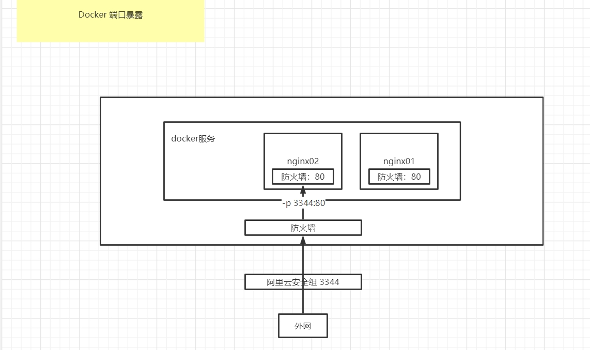

### 端口暴露



### nginx部署安装

```
1.docker pull nginx
2.docker run -d --name nginx01 -p 3344:80 nginx
3.curl localhost:3344 //测试
4.docker exec -it nginx01 /bin/sh   //进入容器,修改配置

root@31138f5fa52f:/# whereis nginx
nginx: /usr/sbin/nginx /usr/lib/nginx /etc/nginx /usr/share/nginx

root@31138f5fa52f:/# cd /etc/nginx
root@31138f5fa52f:/etc/nginx# ls
conf.d	fastcgi_params	mime.types  modules  nginx.conf  scgi_params  uwsgi_params
 
```

### tomcat部署安装
```
官方使用：一般用来测试，用完就删除

docker run -it --rm tomcat:9.0

正确方式：
下载
docker pull tomcat:9.0
启动
docker run -d -p 3355:80 --name tomcat01 tomcat
测试访问
进入容器,发现linux命令少了、webapp文件少了 ==> 原因是阿里云镜像默认是最小可运行的环境

解决：
将webapps.dist里的文件复制到webapps里
```

### es部署安装
```
es 暴露端口很多
es 十分消耗内存  -e ES_JAVA_OPTS="-Xms64m -Xmx512m"
es 的数据需要挂载放置安全目录
es --net somenetwork ？网络配置

docker run -d --name elasticsearch -p 9200:9200 -p 9300:9300 -e "discovery.type=single-node" -e ES_JAVA_OPTS="-Xms64m -Xmx512m" elasticsearch:7.6.2

```

### portainer安装
```
Docker的图形化工具
```
### mysql部署安装

```

```