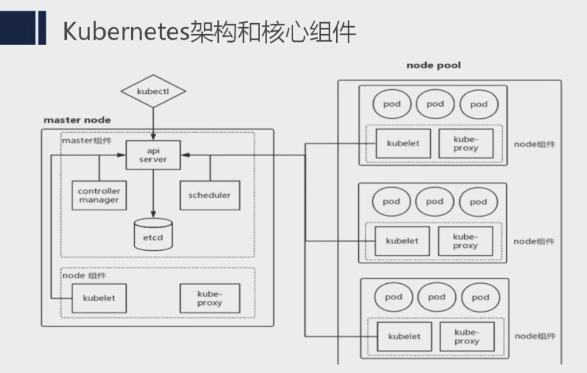

### 什么是k8s?

Kubernetes是容器集群管理系统，是一个开源的平台，可以实现容器集群的自动化部署、自动扩缩容、维护等功能。


传统操作系统和云原生操作系统

Linux和windows是底层硬件的抽象层：
    向下管理硬件,把硬件抽象成易用的接口
    向上对应用层提供支持
    
k8s 可以理解成os：
    向下管理的是集群,集群是dockers容器组成的
     向上对应用层提供支持
   
service mesh
    服务网格  
```
使用kubectl创建一个部署
    https://kubernetes.io/docs/tutorials/hello-minikube/

k8s集群的网络
    https://blog.csdn.net/qq_21187515/article/details/101363521
    三种IP:PodIP、ClusterIP和外部IP

```

--------
### 核心功能
```

1、部署应用
    kubectl run xxxxName --image=xxxx --port=8080
2、访问应用
3、scale
4、滚动更新
5、核心组件
```

--------
### 核心组件
```
Master：
    所有集群的控制命令都传递给master组件并在上执行
    每个k8s至少有一个master组件

API Server：
    集群控制的唯一入口,提供控制集群RestFulAPI的组件
    各个组件数据交互的中枢,通过grpc通信

Sheduler：
    调度算法、选择一个合适的pod
    也可以自定义调度算法

Controller Manager：
    管理资源
    
etcd：
    和 zk 相似
    
Node：
    kubelet:
        master和node的桥梁，master通过kubelet通知Node
    kube-proxy:
        做负载均衡，默认选择是iptables
    pod:
        有很多种类型:service、...
    
```



--------
### 重要概念
```
cluster
Master
Node
Pod
Controller
Service
NameSpace
Volume
Secret
Label

```

--------
### 部署 k8s Cluster
```
安装docker
安装kubelet,kubeadm和kubectl
用kubeadm创建cluster
初始化mater
配置kubectl
安装pod网络
添加k8s-node1和k8s-node2
```


