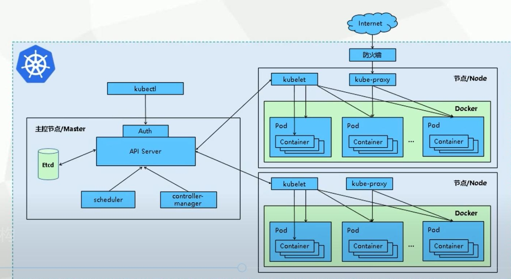
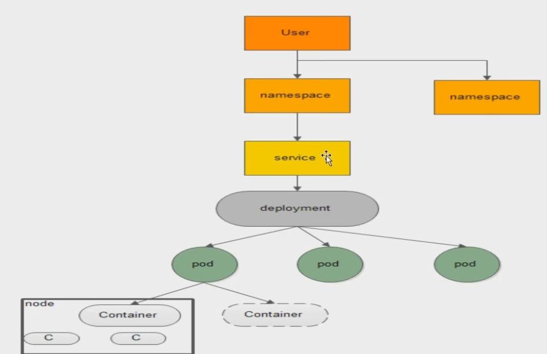
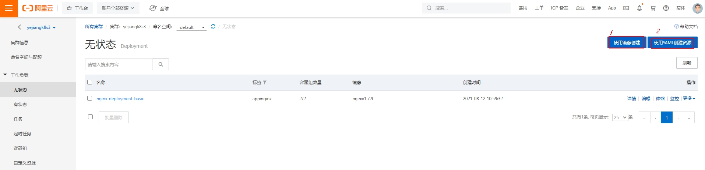
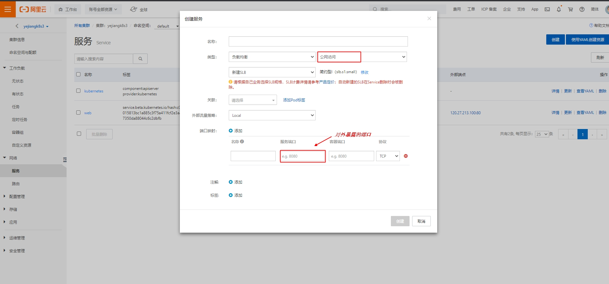

[TOC]

## 一、认识Docker

#### 1.什么是Docker

```
项目带上环境安装打包 ， 发布一个项目 (jar + 环境)
```

#### 2.Docker的组成

```
image(镜像)
	镜像就好比是一个模板,通过模板可以创建容器(docker run)
	通过镜像可以创建多个容器
container(容器)
	可以把容器简单理解为一个缩小版的Linux
repository(仓库)
	存放镜像的地方，仓库分为共有仓库额私有仓库，可以类比maven仓库
	Docker Hub、阿里云... 等都有自己的容器服务器
```

#### 3.DockerFile

```
DockerFile就是用来构建docker都镜像构建文件！命令脚本!

FROM centos
RUN yum install wget
RUN wget -O redis.tar.gz "http://download.redis.io/releases/redis-5.0.3.tar.gz"
RUN tar -xvf redis.tar.gz
以上执行会创建 3 层镜像。可简化为以下格式：
FROM centos
RUN yum install wget \
    && wget -O redis.tar.gz "http://download.redis.io/releases/redis-5.0.3.tar.gz" \
    && tar -xvf redis.tar.gz
    
    
docker build -t nginx:v3 .
```

#### 4.将镜像发布到阿里云

管理镜像地址：https://cr.console.aliyun.com/cn-hangzhou/instances

```
1. 登录阿里云Docker Registry
$ docker login --username=叶江110 registry.cn-hangzhou.aliyuncs.com
用于登录的用户名为阿里云账号全名，密码为开通服务时设置的密码。
您可以在访问凭证页面修改凭证密码。

2. 从Registry中拉取镜像
$ docker pull registry.cn-hangzhou.aliyuncs.com/muyer-hub/hub1:[镜像版本号]

3. 将镜像推送到Registry
$ docker login --username=叶江110 registry.cn-hangzhou.aliyuncs.com$ docker tag [ImageId] registry.cn-hangzhou.aliyuncs.com/muyer-hub/hub1:[镜像版本号]$ docker push registry.cn-hangzhou.aliyuncs.com/muyer-hub/hub1:[镜像版本号]
请根据实际镜像信息替换示例中的[ImageId]和[镜像版本号]参数。

4. 选择合适的镜像仓库地址
从ECS推送镜像时，可以选择使用镜像仓库内网地址。推送速度将得到提升并且将不会损耗您的公网流量。
如果您使用的机器位于VPC网络，请使用 registry-vpc.cn-hangzhou.aliyuncs.com 作为Registry的域名登录。


===========================================================================================
# docker images
REPOSITORY   TAG       IMAGE ID       CREATED       SIZE
tomcat       9.0       710ec5c56683   5 days ago    668MB
wordpress    latest    baf5889057ff   13 days ago   551MB
nginx        latest    08b152afcfae   2 weeks ago   133MB
mysql        5.7       8cf625070931   2 weeks ago   448MB

sudo docker login --username=叶江110 registry.cn-hangzhou.aliyuncs.com

# docker tag nginx registry.cn-hangzhou.aliyuncs.com/muyer-hub/hub1:1.0

# docker push registry.cn-hangzhou.aliyuncs.com/muyer-hub/hub1:1.0
The push refers to repository [registry.cn-hangzhou.aliyuncs.com/muyer-hub/hub1]
e3135447ca3e: Pushed 
b85734705991: Pushed 
988d9a3509bb: Pushed 
59b01b87c9e7: Pushed 
7c0b223167b9: Pushed 
814bff734324: Pushed 
1.0: digest: sha256:3f13b4376446cf92b0cb9a5c46ba75d57c41f627c4edb8b635fa47386ea29e20 size: 1570
```

### 5.Docker 如何暴露端口


#### 6.当docker多了如何管理呢？

```
docker              --> low
	docker run -d 镜像名 
compose	        	--> 单机下运行多个容器
	docker-compose up
swarm、k8s     	   -->  集群
```


## 二、认识K8S结构

#### 1.简介

```
Kubernetes是容器集群管理系统，是一个开源的平台，可以实现容器集群的自动化部署、自动扩缩容、维护等功能。

Linux和windows是底层硬件的抽象层：
    向下管理硬件,把硬件抽象成易用的接口
    向上对应用层提供支持
    
k8s 可以理解成os：
    向下管理的是集群,集群是dockers容器组成的
     向上对应用层提供支持
```

#### 2.结构和核心组件



```
Master：
    所有集群的控制命令都传递给master组件并在上执行
    每个k8s至少有一个master组件

API Server：
    集群控制的唯一入口,提供控制集群RestFulAPI的组件
    各个组件数据交互的中枢,通过grpc通信

Sheduler：
    调度算法、选择一个合适的pod
    也可以自定义调度算法

Controller Manager：
    管理资源
    
etcd：
    和 zk 相似
    
Node：
    kubelet:
        master和node的桥梁，master通过kubelet通知Node
    kube-proxy:
        做负载均衡，默认选择是iptables
    pod:
    service
    什么是service?
    	是发现后端pod服务  ==> 发现服务
    	是为一组具有相同功能的容器应用提供一个统一的入口地址 ==> 负载均衡
    	是将请求进行负载分发到后端的各个容器应用上的控制器
```




## 三、创建K8S集群

#### 1.创建集群

```
1.登录管理后台：
	https://cs.console.aliyun.com/?spm=a2c4g.11186623.2.6.1f9929dbBAzUJi#/k8s/cluster/list
2.在控制台左侧导航栏中，单击集群。
3.在集群列表页面中，单击页面右上角的创建集群。
4.单击ASK集群页签，然后完成集群配置
5.创建成功后,可以在kubernetes 集群列表看到创建的集群
```


#### 2.通过kubectl连接集群

```
1) 将集群信息 --> 连接信息 --> 内网访问 配置信息 复制到计算机 $HOME/.kube/config 文件下
vim admin.conf
sudo mv admin.conf $HOME/.kube/config

2) 查看连接
kubectl config current-context
kubectl get all
```


#### 3.创建应用并且发布服务

> 创建应用

通过页面点击



通过yaml方式

```
创建名为nginx.yaml的YAML文件
  apiVersion: v1
  kind: Service
  metadata:
    name: nginx-service
  spec:
    ports:
    - port: 80
      protocol: TCP
    selector:
      app: nginx
    type: LoadBalancer
    
kubectl apply -f nginx.yaml
```

> 发布服务

通过页面点击：点击 网络 --> 点击创建



通过yaml方式 [略]

> 测试地址

```
可看到服务列表有外部端点：120.27.213.100:80
```


扩容Deployment。

```
kubectl get deploy
NAME           READY   UP-TO-DATE   AVAILABLE   AGE
nginx-deploy   2/2     2            2           9m32s

kubectl scale deploy nginx-deploy --replicas=10
deployment.extensions/nginx-deploy scaled

kubectl get pod
10个..
```


应用副本缩容

```
kubectl get pod
NAME                            READY   STATUS    RESTARTS   AGE
nginx-deploy-55d8dcf755-rchhq   1/1     Running   0          16m

kubectl autoscale deployment nginx-deploy --cpu-percent=50 --min=1 --max=10
horizontalpodautoscaler.autoscaling/nginx-deploy autoscaled

kubectl get hpa
```


## 四、未完成实验

创建两个应用

打成镜像发布到镜像仓库

通过集群发布服务

调用、实验扩容等

## 五、Ingress	原理

#### 1、Service

https://segmentfault.com/a/1190000019376912

service作为一个类似中介的角色，对内，它要能代理访问到不断变换的一组后端Pod；对外，它要能暴露自己给集群内部或外部的其他资源访问

>  service的三种方式ClusterIP、NodePort与LoadBalance

​	ClusterIP：集群内部才能访问

​	NodePort：<NodeIp>:<NodePort>

```
## 创建svc，通过Nodeport方式暴露服务
$ kubectl expose deployment goweb --name=gowebsvc-nodeport --port=80  --target-port=8000  --type=NodePort 
## 查看svc，可以看到NodePort随机分配的端口为32538
$ kubectl get svc gowebsvc-nodeport 
NAME                TYPE       CLUSTER-IP       EXTERNAL-IP   PORT(S)        AGE
gowebsvc-nodeport   NodePort   10.101.166.252   <none>        80:32538/TCP   86s
## 随便访问一个nodeip的32538端口,都可以访问到gowebsvc-nodeport服务对应的pod
$ curl 172.16.201.108:32538/info
Hostname: goweb-55c487ccd7-pp6t6
$ curl 172.16.201.109:32538/info
Hostname: goweb-55c487ccd7-5t2l2
```

​	LoadBalance

​	缺点

```
ClusterIP的方式只能在集群内部访问。
NodePort方式的话，测试环境使用还行，当有几十上百的服务在集群中运行时，NodePort的端口管理是灾难。
LoadBalance方式受限于云平台，且通常在云平台部署ELB还需要额外的费用。
```

>  创建方式有两种：命令式 和 声明式(yaml)

#### 2、Ingress

https://segmentfault.com/a/1190000019908991

https://blog.csdn.net/cbmljs/article/details/103183927

定义规则来允许进入集群的请求被转发到集群中对应服务上，从来实现服务暴露


Ingress 能把集群内 Service 配置成外网能够访问的 URL，流量负载均衡，终止SSL，提供基于域名访问的虚拟主机等等。


群维度暴露服务的方式，Ingress可以理解问service的service，他通过独立的ingress对象来制定请求转发的规则，把请求路由到一个或多个service中。这样就把服务与请求规则解耦了，可以从业务维度统一考虑业务的暴露，而不用为每个service单独考虑

> ingress和ingress-controller

```
ingress对象：
指的是k8s中的一个api对象，一般用yaml配置。作用是定义请求如何转发到service的规则，可以理解为配置模板。
ingress-controller：
具体实现反向代理及负载均衡的程序，对ingress定义的规则进行解析，根据配置的规则来实现请求转发。

ingress-controller才是负责具体转发的组件，通过各种方式将它暴露在集群入口，外部对集群的请求流量会先到ingress-controller，而ingress对象是用来告诉ingress-controller该如何转发请求，比如哪些域名哪些path要转发到哪些服务等等。
```

>  [Ingress Controller](https://kubernetes.io/docs/concepts/services-networking/ingress-controllers/#additional-controllers)

```
ingress-controller并不是k8s自带的组件，实际上ingress-controller只是一个统称，用户可以选择不同的ingress-controller实现

k8s维护的ingress-controller只有google云的GCE与ingress-nginx两个，其他还有很多第三方维护的ingress-controller

实现的机制都大同小异，只是在具体配置上有差异

ingress-controller的形式都是一个pod，里面跑着daemon程序和反向代理程序。daemon负责不断监控集群的变化，根据ingress对象生成配置并应用新配置到反向代理，比如nginx-ingress就是动态生成nginx配置，动态更新upstream，并在需要的时候reload程序应用新配置
```

> Ingress

```
ingress是一个API对象，和其他对象一样，通过yaml文件来配置。ingress通过http或https暴露集群内部service，给service提供外部URL、负载均衡、SSL/TLS能力以及基于host的方向代理。

ingress要依靠ingress-controller来具体实现以上功能。


--- 
apiVersion: extensions/v1beta1
kind: Ingress
metadata:
  name: abc-ingress
  annotations: 
    kubernetes.io/ingress.class: "nginx"
    nginx.ingress.kubernetes.io/use-regex: "true"
spec:
  tls:
  - hosts:
    - api.abc.com
    secretName: abc-tls
  rules:
  - host: api.abc.com
    http:
      paths:
      - backend:
          serviceName: apiserver
          servicePort: 80
  - host: www.abc.com
    http:
      paths:
      - path: /image/*
        backend:
          serviceName: fileserver
          servicePort: 80
  - host: www.abc.com
    http:
      paths:
      - backend:
          serviceName: feserver
          servicePort: 8080
```

> ## ingress的部署

```
Deployment+LoadBalancer模式的Service [比较适合]

Deployment+NodePort模式的Service

DaemonSet+HostNetwork+nodeSelector
```


#### 3、Service、Ingress和Ingress Controller的关系

```
Service是后端真实服务的抽象，一个Service可以代表多个相同的后端服务。

Ingress是反向代理规则，用来规定HTTP/HTTPS请求应该被转发到哪个Service上。例如根据请求中不同的Host和URL路径，让请求落到不同的 Service上。

Ingress Controller是一个反向代理程序，负责解析Ingress的反向代理规则。如果Ingress有增删改的变动，Ingress Controller会及时更新自己相应的转发规则，当Ingress Controller收到请求后就会根据这些规则将请求转发到对应的Service。
```

#### 4、阿里云ASK的Ingress

>  ALB Ingress Controller

创建

```
方式一：创建集群时安装ALB Ingress Controller
	创建ASK集群时，在Ingress参数配置区域，选择安装ALB Ingress。
方式二：在组件管理页面安装ALB Ingress Controller
  登录容器服务管理控制台。
  在控制台左侧导航栏中，单击集群。
  在集群列表页面中，单击目标集群名称或者目标集群右侧操作列下的详情。
  在集群管理页左侧导航栏中，选择运维管理 > 组件管理。
  单击其他页签，在ALB Ingress Controller组件区域单击安装。
```

访问服务


```
步骤：
https://help.aliyun.com/document_detail/280446.html?spm=a2c4g.11186623.6.1270.50cf342evCTzAl
1、创建 cafe-service.yaml  
2、kubectl apply -f cafe-service.yaml
3、kubectl get svc,deploy
4、配置Ingress：创建并拷贝以下内容到cafe-ingress.yaml文件
5、kubectl apply -f cafe-ingress.yaml
6、kubectl get ingress
7、通过浏览器访问coffee服务
8、通过浏览器访问tea服务
```


