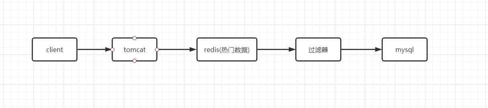

### 一、什么是缓存穿透、缓存雪崩、缓存击穿

1. BS架构：client --> tomcat --> mysql

2. 当用户量增大，mysql成为瓶颈，我们需要减少mysql连接（使用连接池）

    除此之外，我们还可以：分库分表、mysql集群、加缓存层redis
    
    
    

3. 三个区别？

缓存击穿

```
eg: 缓存时间到期

解决：
1、设置热点数据不过期
2、加锁，没获取到就查询数据库
```


缓存雪崩

```
eg.大批量缓存时间到期
解决：
1、设置过期时间，防止同一时间大批量的数据过期
2、设置热点数据不过期
```

缓存击穿

```
eg.id=-1的数据在缓存和db都中查不到，击穿了db都查不到
1、接口做校验，例如id>0
2、对击穿数据库的数据做缓存，key-value=key-null，可以防止反复暴力攻击
```