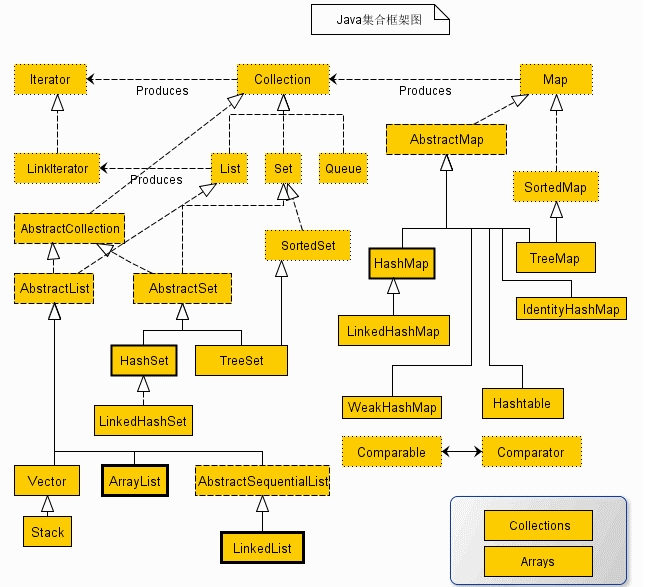

[TOC]

# Java基础
### 1. 介绍一下集合框架

 


### 2. Hashmap底层实现？

[link](https://blog.csdn.net/xuhuaabc/article/details/91475761)

```
1) jdk1.2引入Map实现类的，基于hash实现，每个元素数k-v键值对，内部通过单链表解决冲突问题，当达到阈值时会自动增长

2) 非线程安全，多线程可以用ConcurrentHashMap代替

3) 实现了Cloneable, Serializable 接口，可以被克隆和序列化  

4）Key和value都可以为null，key为null的键值永远都放在table[0]的位置

5) put方法的存储过程==>

6) 扩容机制
    a.内部Entry数组默认长度是16
    b.当size大于threshold时，对HashMap进行扩容==>
    c.扩容是是新建了一个HashMap的底层数组，而后调用transfer方法,将就HashMap的全部元素添加到新的HashMap中(需要重新hash一次)。
    d.扩容是一个相当耗时的操作，因为它需要重新计算这些元素在新的数组中的位置并进行复制处理。因此，我们在用HashMap的时，最好能提前预估下HashMap中元素的个数，这样有助于提高HashMap的性能。


```
### 3. Hashtable底层实现？
```
Hashtable和HashMap两种集合非常相似，区别如下：
1) HashMap线程不安全，多线程场景下会出现数据不一致情况；Hashtable读写都通过synchronized加锁保护，线程安全，但是性能比较低
2) HashMap中key-value都可以存null,而Hashtable中不允许存null
3) HashMap的迭代器(Iterator)是fail-fast迭代器；但是Hashtable的迭代器(enumertor)不是fast-fail的。如果有其他线程对HashMap进行添加删除操作，会抛出ConcurrentModificationException，但是调用迭代器的remove方法就不会


底层：其数据结构与HashMap是相同的
继承：Dictionary
实现: Map、CloneAble、Serializable
主要方法：
put

先获取synchronized锁。
put方法不允许null值，如果发现是null，则直接抛出异常。
计算key的哈希值和index
遍历对应位置的链表，如果发现已经存在相同的hash和key，则更新value，并返回旧值。
如果不存在相同的key的Entry节点，则调用addEntry方法增加节点。
addEntry方法中，如果需要则进行扩容，之后添加新节点到链表头部。

get

先获取synchronized锁。
计算key的哈希值和index。
在对应位置的链表中寻找具有相同hash和key的节点，返回节点的value。
如果遍历结束都没有找到节点，则返回null。

remove

先获取synchronized锁。
计算key的哈希值和index。
遍历对应位置的链表，寻找待删除节点，如果存在，用e表示待删除节点，pre表示前驱节点。如果不存在，返回null。
更新前驱节点的next，指向e的next。返回待删除节点的value值。

rehash

数组长度增加一倍（如果超过上限，则设置成上限值）。
更新哈希表的扩容门限值。
遍历旧表中的节点，计算在新表中的index，插入到对应位置链表的头部。

```
### 4. CurrentHashMap和CurrentHashtable底层实现？
```

```

### 5.AQS 对资源的共享方式 
```
1)Exclusive（独占）
只有一个线程能执行，如ReentrantLock。又可分为公平锁和非公平锁,ReentrantLock 同时支持两种锁
2)Share（共享）
多个线程可同时执行，如Semaphore/CountDownLatch
```
### 6.AQS 组件总结
```
信号量Semaphone：
    允许多个线程同时访问
    synchronized和ReentrantLock只允许一个线程，semaphore可以指定多个线程同时访问某个资源
倒计时器CountDownLatch：
    让一个线程等待直到计数器的值为0时，才继续执行
循环栅栏CyclicBarrir:
    让一组线程到达屏障的时候被阻塞，直到最后一个线程到达屏障的时候，屏障才会解除，所有线程才会被继续执行
```

### 7.介绍下 Java 内存区域（运行时数据区） ？
```
Java栈
本地方法栈
程序计数器
堆
    四个区
    eden垃圾回收->s0或者s1->s0,s1反复复制，每复制一次年龄加1->当15岁的时候进入老年
    -xx:MaxTenuringThreshold设置默认岁
方法区：
    局部变量表、操作数栈、动态链接、出口信息
注意的问题：
    1.线程私有和线程共享
```

### 8.Java 对象的创建过程？
```
类加载检查
    new指令，检查参数是否能在常量池中定位到这个符号引用
    检查这个符号引用代表的类是否被加载、解析和初始化过==>如果没有就执行类加载过程
分配内存
    在堆中划分确定的内存分配
    分配的方式：指针碰撞和空闲列表(是否规则决定，GC收集器有没有压缩整理功能决定)
初始化0值
    保证类中的成员变量不赋初值零值也能够直接用
设置对象头
    对象头会设置 锁的状态信息；hashCode；GC分代年龄等
执行init方法
```